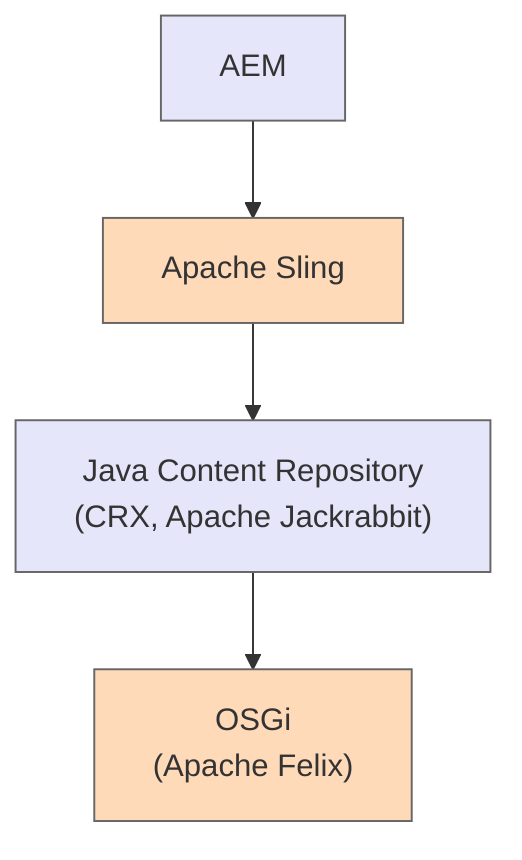

## AEM Technology Stack 

Let me extract the text information from the Java Content Repository image:

## Java Content Repository

◇ JCR: Java Content Repository

◇ JackRabbit framework used to build JCR

◇ Query language called XPATH for retrieving information from XML. AEM is internally using XPATH to fetch the information

◇ Two storage implementations available: TAR and Mongo DB

◇ Mongo DB for high performance & clustered applications and TAR used by default

