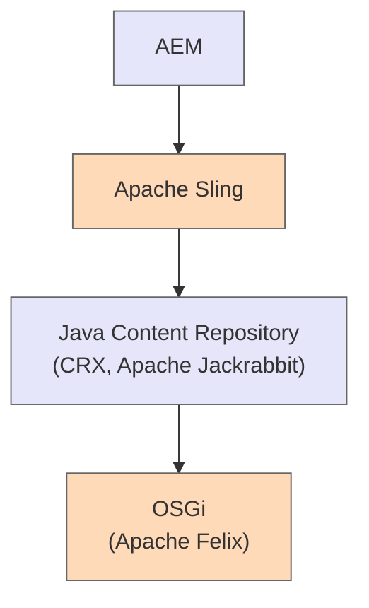
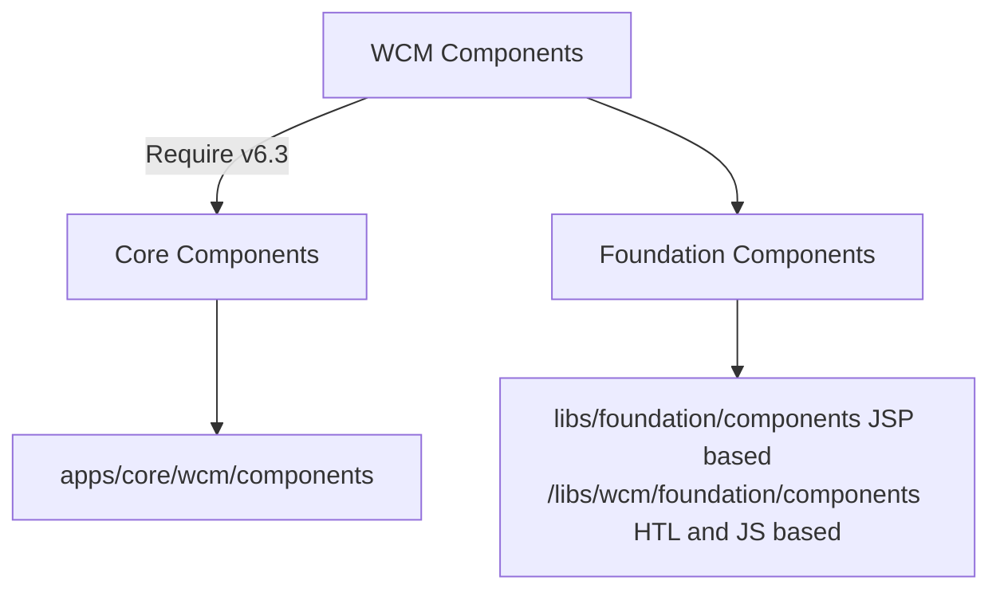

## AEM Technology Stack 

Let me extract the text information from the Java Content Repository image:

## Java Content Repository

◇ JCR: Java Content Repository

◇ JackRabbit framework used to build JCR

◇ Query language called XPATH for retrieving information from XML. AEM is internally using XPATH to fetch the information

◇ Two storage implementations available: TAR and Mongo DB

◇ Mongo DB for high performance & clustered applications and TAR used by default

## OSGi

◇ Fundamental layer of AEM Stack

◇ OSGi application is a collection of bundles that interact using service interfaces

◇ OSGi bundles can contain compiled Java code, scripts, content that is to be loaded in the repository, and configuration or additional files

◇ Bundles may be independently developed and deployed

◇ OSGi Management Console:
http://localhost:4502/system/console

## Core vs Foundation Components

# Core vs Foundation Components

| Feature | Core | Foundation |
|---------|------|------------|
| Markup | HTL | JSP code |
| Dialog Definition | Coral 3 | Coral2 + Classic UI |
| Apache License | Apache License | Proprietary of Adobe |
| Implementation | Java POJOs with Sling Models annotations | Implementation: JSP code |
| Delivery | Delivered in and through GitHub: https://github.com/Adobe-Marketing-Cloud/aem-core-wcm-components | Delivery is via QuickStart |
| Technology used | Sling Models, HTL, Touch UI etc. | JavaScript Use-API, JSP, Classic UI |