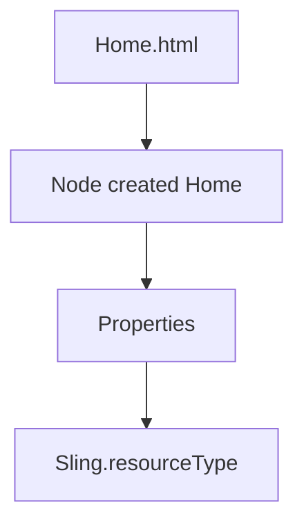

# Replication

 Author -> Publish 

 ##  Reverse Replication

 Publish -> Author

 ex. blog comments

 ## Replication Agent

 From author whenever we activate it keeps adding to bucket which is called Replication Queue (On Author). The publisher has listener which keeps checking the Author's queue and whenever it finds something it picks up and replicates itself.

