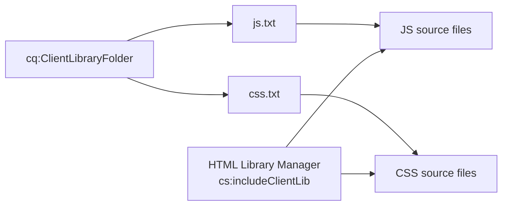

# Client Libs

# Using Client-side Libraries - The Solution

## Client-Side Libraries Overview
- Client-Side Library Folder allows you to store client side code in the repository
- Client Library (or ClientLib) will manage all your JavaScript and CSS resources in your application
- Takes care of dependency management, merging files and minifying content
- A client-side library folder is a repository node of type cq:ClientLibraryFolder
- Use HTL or JSP to include Client-side Libraries in AEM

## ClientLib Components
- The JS and/or CSS source files to merge
- Resources that support CSS styles, such as image files
- One js.txt file - Use this file name to generate a JavaScript file
- One css.txt file - Use this file name to generate a Cascading Style Sheet

This shows how ClientLib manages and processes JS and CSS resources through the HTML Library Manager for efficient client-side resource delivery.