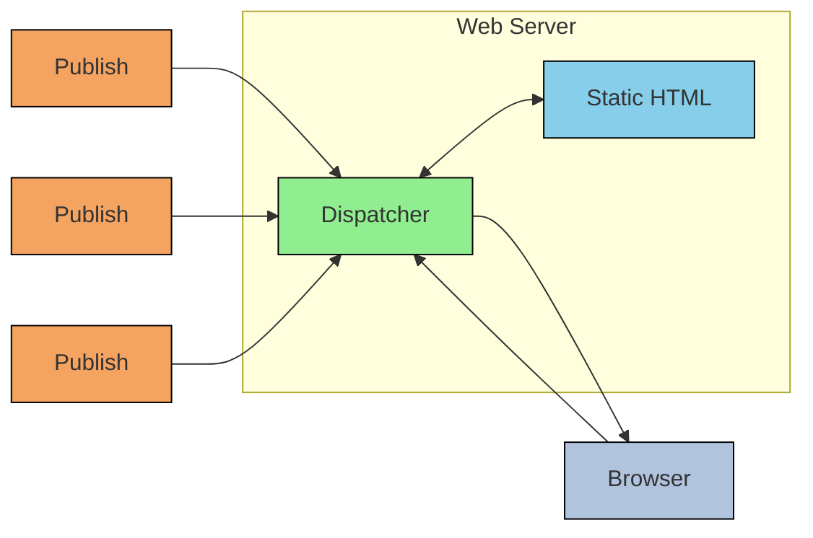

## Dispatcher

◇ Dispatcher is AEM's caching and/or load balancing tool.

◇ Installed and configured on web server

◇ Protects your AEM server from attack

◇ Provides Security as which URLs are accessible or filtered

◇ Provides load balancing like which requests to be forwarded to the application server or Publisher

◇ Provide Caching of web pages produced by Publisher instance to improve performance

